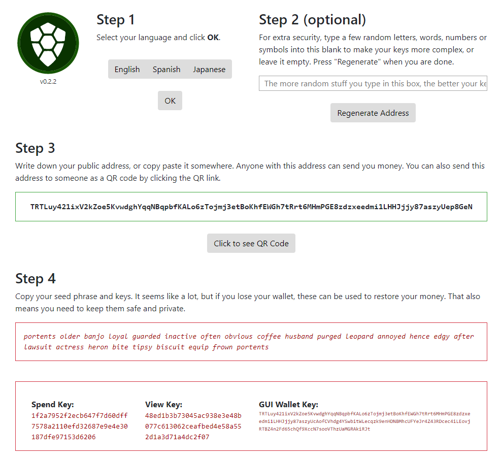

Simple mnemonic decoder
=======================

Usage: ```node mn_decode.js -d [mnemonic]```

Example:
```
node mn_decode.js -d "portents older banjo loyal guarded inactive often obvious coffee husband purged leopard annoyed hence edgy after lawsuit actress heron bite tipsy biscuit equip frown portents"
```

Output:
```
Correct way:
-------------------
Address  : TRTLv3EekwH7VcXfKnfLPjKjeQSrX7YW5AHzapcHvpDaEvgvq458ENSUyxeHG2FmDTYJwM2Zft1SeUicr8svnRQDW4ecGw3xtZx
View Key : 84689a830b24b234286a5dfaec25377882018e80d6bd1f41690477f3c7011d08
Spend Key: ebb7f47cfd9e280e4167e08fa06dc0cc085d25dd323f3a881db4a3be415f1a0d
===================
Buggy way:
-------------------
Address  : TRTLuy421ixV2kZoe5KvwdghYqqNBqpbfKALo6zTojmj3etBoKhfEWGh7tRrt6MHmPGE8zdzxeedmi1LHHJjjy87aszyUep8GeN
View Key : 48ed1b3b73045ac938e3e48b077c613062ceafbed4e58a552d1a3d71a4dc2f07
Spend Key: 1f2a7952f2ecb647f7d60dff7578a2110efd32687e9e4e30187dfe97153d6206
```

Compare with paper wallet:

